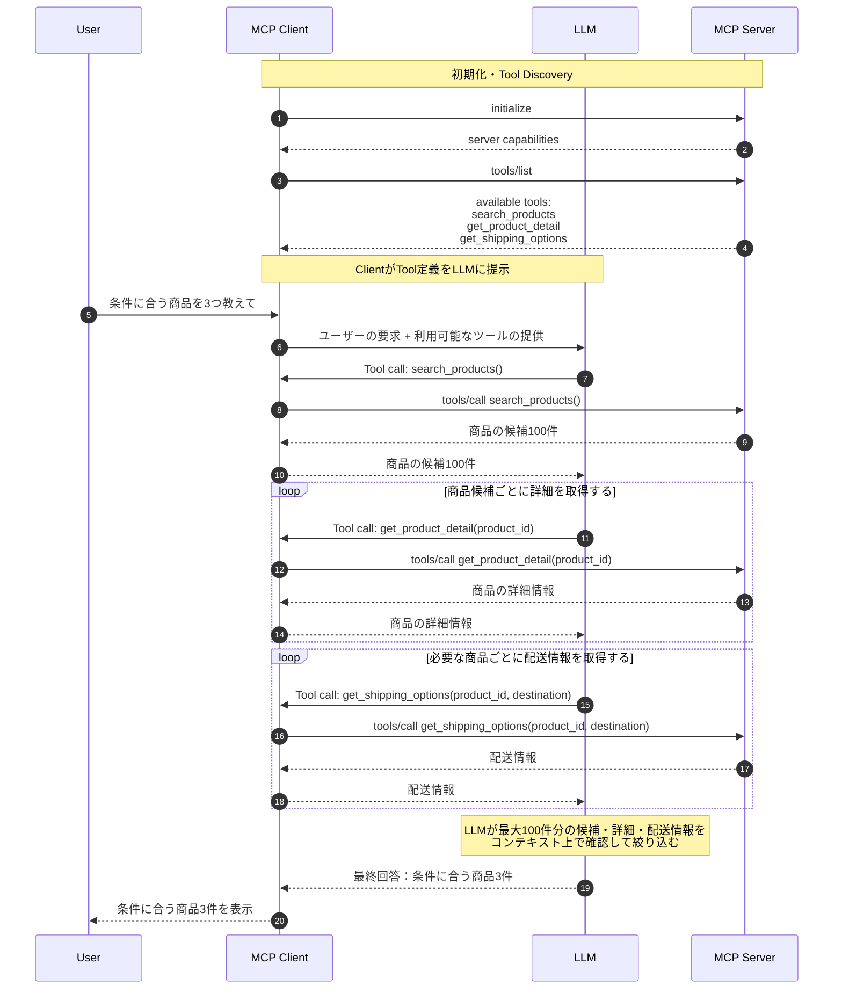
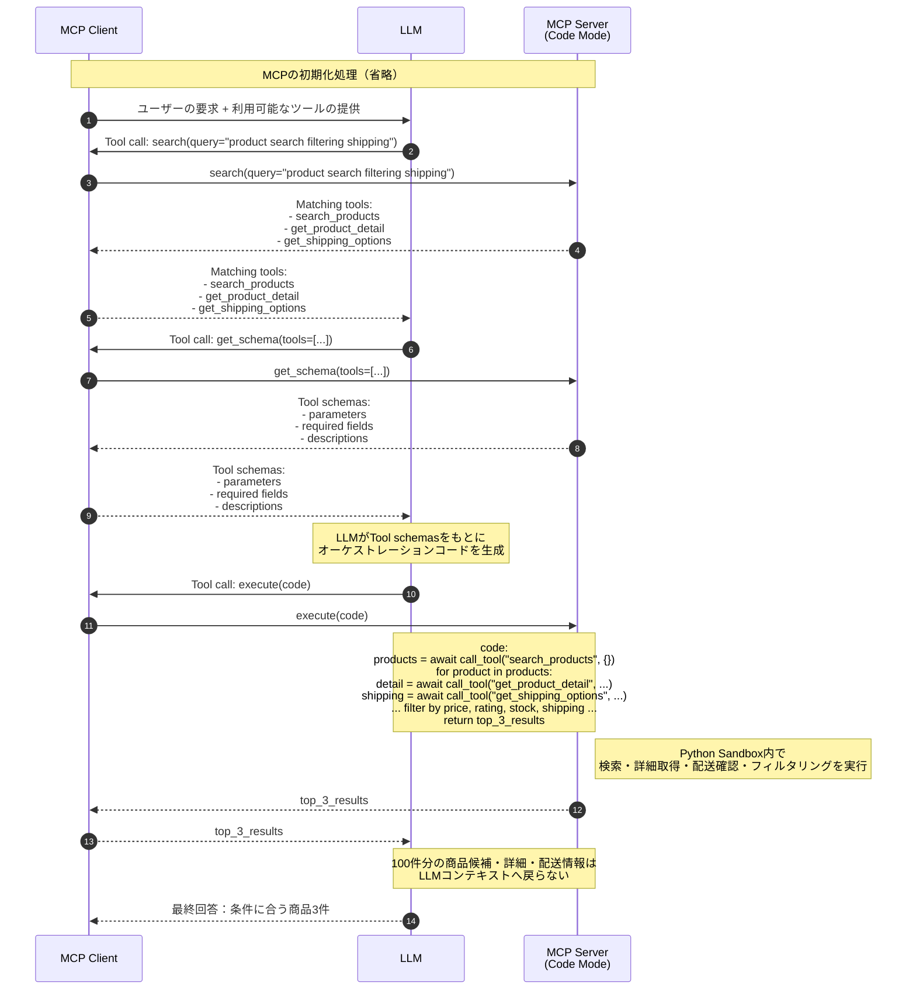

## はじめに

こんにちは🖐️ 今日は個人的に興味を持ったFastMCPのCode Modeを調べてみました。MCP(Model Context Protocol)は、LLMと外部ツールを接続するための標準仕様として現在も広く使われていますが、LLMとの毎回のやりとりに実行可能なツールの一覧が含まれてしまったり、解決するタスクによってはトークンが大量に消費されてしまうことが課題として挙げられています。FastMCPのCode Modeはこれを解決するための一つのアプローチとして、LLMが与えられたツールを使ってタスクを解くための簡易的なオーケストレーションコードを生成し、それを分離環境で実行することで、LLMとツールのやり取りのトークン効率を向上させることを目的としています。

## FastMCPのCode Modeとは

:::message

Code Modeという考え方は、Cloudflareによって初めて提案がされ、MCPの生みの親であるAnthropicでもCode executionという形で紹介がされています。

https://blog.cloudflare.com/code-mode/

https://www.anthropic.com/engineering/code-execution-with-mcp

:::

[はじめに](#はじめに)でも概要を説明しましたが、もう少し例を交えて説明します。例えば、以下のようなツールをMCPサーバーが備えているとします。

- `search_products()`: 商品の候補を100件返す
- `get_product_detail(product_id)`: 商品詳細、在庫、価格、レビュー評価を返す
- `get_shipping_options(product_id, destination)`: 配送可否と日数を返す

これに対して、エンドユーザーから「東京に配送可能で、在庫があって、レビュー評価が4.5以上、価格が3万円以下な商品を3つ教えて」というプロンプトが投げられたことを考えてみましょう。この時、簡易的な通信の流れは以下のようになります。



上記の流れの通り、LLMには最大100件分の商品の候補、詳細、配送情報がコンテキストとして提供されることになります。このように、比較的量が多いデータから絞り込んだ結果を返却するようなタスク[^1]では、絞り込みをLLMで実現するためにはLLMへフィルター対象の全件分のコンテキストを渡す必要があり、トークン消費量が増えてしまうことがわかります。

[^1]: そもそもこんなタスクをLLMでやらせるな！という意見はもっともだと思いますし、私自身もそう思いますがあくまでわかりやすさを優先した例として...

これに対し、FastMCPのCode Modeでは、MCPサーバーは以下のようなツール群を提供します。

- `search(query)`: 条件に合ったツールを返却する
- `get_schema(tools)`: ツールのスキーマ（関数のシグネチャなど）を返却する
- `execute(code)`: MCPサーバーに実行させるコードを受け取る

一連の流れは以下のようになります。



ここで注目するべきなのは、13番で実際LLMに渡されるコンテキストが、100件分の商品候補や詳細、配送情報ではなく、最終的な絞り込み結果の3件分のみである点です。100件 -> 3件への絞り込みはLLMが実装したオーケストレーションコードによって実施されます。これにより、LLMへ渡すトークン量を大幅に削減することが期待されます。

この流れを支える重要な仕組みも合わせて説明します。まずは、ツールの検索です。検索はドキュメントに記載がある通り、デフォルトではBM25[^2]を用いて実装されています[^3]。

> Search finds tools by natural-language query using BM25 ranking.

[^2]: BM25は、情報検索の分野で広く使われているランキング関数で、クエリとドキュメントの関連性をスコアリングするための手法のこと。

[^3]: [https://gofastmcp.com/servers/transforms/code-mode#search](https://gofastmcp.com/servers/transforms/code-mode#search)

続いて、ツールの実行（`/execute`）です。LLMが実装したコードを実行することはセキュリティ上のリスクを伴いますが、FastMCPのCode Modeでは、`MontySandboxProvider` という実行時間やメモリ使用量、オブジェクトの割り当て上限、再帰の深さ上限、ガベージコレクションの頻度のようなリソース制限を設けることができます。そのようなサンドボックス環境でPythonコードを実行することで、リスクを軽減しています[^4]。

[^4]: [https://gofastmcp.com/servers/transforms/code-mode#execute](https://gofastmcp.com/servers/transforms/code-mode#execute)

また、サンドボックス環境では実行可能な関数も `call_tool` のみであるため、LLMが実装したコードは、あくまでMCPサーバーが提供するツールを呼び出すためのオーケストレーションコードに限定される点も重要なポイントです。これにより、LLMが任意のコードを実行してしまうリスクも軽減されます。

## 実際に試してみた

それでは実際に試してみます。今回は、以下のようなMCPサーバーを立ててみました。

```python
import argparse
import random
import sys

from fastmcp import FastMCP
from fastmcp.experimental.transforms.code_mode import CodeMode, MontySandboxProvider

random.seed(42)

_DESC = (
    "A sample product with a deliberately long description so that each "
    "detail payload carries real weight. It covers materials, dimensions, "
    "warranty, and usage notes, none of which matter to the filter but all "
    "of which inflate the response when loaded into the model context."
)

PRODUCTS = [
    {
        "id": f"p-{i}",
        "name": f"Product {i}",
        "price": random.randint(5_000, 80_000),
        "rating": round(random.uniform(3.0, 5.0), 1),
        "in_stock": random.choice([True, False]),
        "ships_to_tokyo": random.choice([True, False]),
        "shipping_days": random.randint(1, 10),
        "description": _DESC,
    }
    for i in range(1, 101)
]


def build_server(use_code_mode: bool) -> FastMCP:
    name = "Local Product Search (code mode)" if use_code_mode else "Local Product Search (direct)"
    sandbox = MontySandboxProvider(
        limits={"max_duration_secs": 30, "max_memory": 50_000_000}
    )
    transforms = [CodeMode(sandbox_provider=sandbox)] if use_code_mode else []
    mcp = FastMCP(name, transforms=transforms)

    @mcp.tool
    def search_products() -> list[dict]:
        """Search the catalog. Returns lightweight candidates (id and name only).
        Use get_product_detail for price/rating/stock and get_shipping_options
        for delivery availability."""
        return [{"id": p["id"], "name": p["name"]} for p in PRODUCTS]

    @mcp.tool
    def get_product_detail(product_id: str) -> dict:
        """Get full product detail for a single product: price, rating, stock,
        and description. Must be called per product_id."""
        p = next(p for p in PRODUCTS if p["id"] == product_id)
        return {
            "id": p["id"],
            "name": p["name"],
            "price": p["price"],
            "rating": p["rating"],
            "in_stock": p["in_stock"],
            "description": p["description"],
        }

    @mcp.tool
    def get_shipping_options(product_id: str, destination: str) -> dict:
        """Get shipping availability and estimated delivery days for a single
        product to a destination. Must be called per product_id."""
        p = next(p for p in PRODUCTS if p["id"] == product_id)
        return {
            "product_id": product_id,
            "destination": destination,
            "available": p["ships_to_tokyo"] if destination == "Tokyo" else False,
            "days": p["shipping_days"],
        }

    return mcp


if __name__ == "__main__":
    parser = argparse.ArgumentParser(description="Run the product-search MCP server in code-mode or direct mode.")
    parser.add_argument("--mode", choices=["code", "direct"], default="code",
                        help="code: wrap tools with CodeMode transform; direct: expose tools individually")
    parser.add_argument("--port", type=int, default=None,
                        help="HTTP port (defaults: 8000 for code, 8001 for direct)")
    args = parser.parse_args()

    use_code_mode = args.mode == "code"
    port = args.port if args.port is not None else (8000 if use_code_mode else 8001)

    print(f"[product-search] mode={args.mode} port={port}", file=sys.stderr)
    build_server(use_code_mode).run("streamable-http", port=port)
```

今回は、Claude Codeで以下のような設定ファイルを用いて、`direct`モードと`code`モードを比較してみました。

`direct`モード用の設定ファイル：

```json
{
    "mcpServers": {
        "local-product-search-direct-mode": {
            "type": "http",
            "url": "http://127.0.0.1:8001/mcp/"
        }
    }
}
```

`code`モード用の設定ファイル：

```json
{
    "mcpServers": {
        "local-product-search-code-mode": {
            "type": "http",
            "url": "http://127.0.0.1:8000/mcp/"
        }
    }
}
```

どちらも質問は、「東京に配送可能で、在庫があって、レビュー評価が4.5以上、価格が3万円以下な商品を3つ教えて」という同じ質問を投げています。結果は以下の通りです。（Claude Codeの`/usage`を元に比較をしています）

| モード | 入力トークン数 | 出力トークン数 |
| ------ | -------------- | -------------- |
| direct | 41.4k          | 4.4k           |
| code   | 3.6k           | 1.7k           |

今回は極端にCode Modeが有利なシナリオを選んだため、ある種当たり前な結果となりますが、シナリオによってはトークン消費量が大幅に削減できる可能性があることが確認できました。

## おわりに

今回は、MCP利用でトークン消費量が増えてしまうシナリオに対して、FastMCPのCode Modeがどのようなアプローチで解決を試みているのかを、実際に試してみた結果も交えて紹介しました。Code Modeはまだ実験的な機能ではありますが、LLMとツールのやりとりのトークン効率を向上させるための一つの有望なアプローチであると感じました。今後もこのような機能がどのように発展していくのか、注目していきたいと思います。
