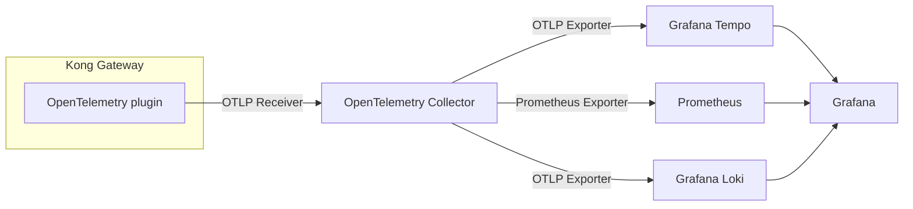

## はじめに

こちらの記事は、[Kong Advent Calendar 2025](https://qiita.com/advent-calendar/2025/kong) の Day24 として書かれています。

Kong Gateway 3.13 で OpenTelemetry プラグインが大幅に改善されました。以前、同じような内容を記事[^1]にしたのですが、その際はメトリクスは Prometheus プラグインを使用し、アクセスログは File Log プラグインを利用しており、OpenTelemetry プラグインは実質トレースだけを担当していました。そのため、decK ファイル自体に監視のために複数のプラグインを設定する必要があり、やや冗長な構成となっていました。

[^1]: [https://zenn.dev/shukawam/articles/kong-observability-otel](https://zenn.dev/shukawam/articles/kong-observability-otel)

## Kong Gateway 3.13 で何が改善されたのか

Change Log を見ると以下のように記載されています。

https://developer.konghq.com/gateway/changelog/#3-13-0-0-feature-plugin

> opentelemetry:
>
> Added support for exporting OpenTelemetry metrics via OTLP/HTTP protocol to an observability backend (e.g. OpenTelemetry Collector). Please enable this feature by configuring the metrics.endpoint parameter in the OpenTelemetry plugin.
>
> Added support for exporting access logs via OTLP/HTTP protocol to an observability backend (e.g. OpenTelemetry Collector). Please enable this feature by configuring the access_logs_endpoint parameter in the OpenTelemetry plugin.

つまり、OpenTelemetry プラグインを用いてアクセスログやメトリクスも OTLP(OpenTelemetry Protocol)形式で出力できるようになりました 🙌

## 実際に試してみる

以下のような構成を作ってみます。



厳密には、OpenTelemetry Collector はなくても実現できるのですが、拡張性などを鑑みて Collector 経由でテレメトリーデータを転送する構成にしています。

decK ファイルは以下のように記述します。

```yaml:kong.yaml
_format_version: "3.0"

services:
  - name: httpbin-service
    url: http://httpbin
    routes:
      - name: httpbin-route
        paths:
          - /mock
        strip_path: true

plugins:
  - name: opentelemetry
    config:
      traces_endpoint: http://otel-collector:4318/v1/traces
      logs_endpoint: http://otel-collector:4318/v1/logs
      access_logs_endpoint: http://otel-collector:4318/v1/logs
      metrics:
        enable_bandwidth_metrics: true
        enable_consumer_attribute: true
        enable_latency_metrics: true
        enable_request_metrics: true
        enable_upstream_health_metrics: true
        endpoint: http://otel-collector:4318/v1/metrics
        push_interval: 60
```

あまり注意点はないですが、唯一気をつけるべき点としては OTLP/gRPC は対応していないので、OTLP/HTTP のエンドポイントを指定する必要がある点です。これに対応する OpenTelemetry Collector の設定ファイルは以下のようになります。

```yaml
receivers:
  otlp:
    protocols:
      grpc:
        endpoint: 0.0.0.0:4317
      http:
        endpoint: 0.0.0.0:4318

processors:
  batch:

exporters:
  otlphttp/tempo:
    endpoint: http://tempo:4318
    tls:
      insecure: true
  prometheus:
    endpoint: 0.0.0.0:8889
  otlphttp/loki:
    endpoint: http://loki:3100/otlp
    tls:
      insecure: true

service:
  pipelines:
    traces:
      receivers: [otlp]
      processors: [batch]
      exporters: [otlphttp/tempo]
    metrics:
      receivers: [otlp]
      processors: [batch]
      exporters: [prometheus]
    logs:
      receivers: [otlp]
      processors: [batch]
      exporters: [otlphttp/loki]
```

手元の環境で試せるように Docker Compose 環境を用意したので、興味がある方は試してみてください。

https://github.com/shukawam/kong-observability-oss

## おわりに

今回は、OpenTelemetry プラグインの改善項目を取り上げました。正直、メトリクスは Prometheus プラグインを使うことで不便さを感じていなかったのですが、アクセスログに関してはかなり改善されたと思います。Kong Gateway 3.13 を使う際はぜひ試してみてください。
