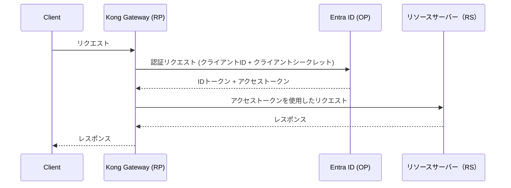
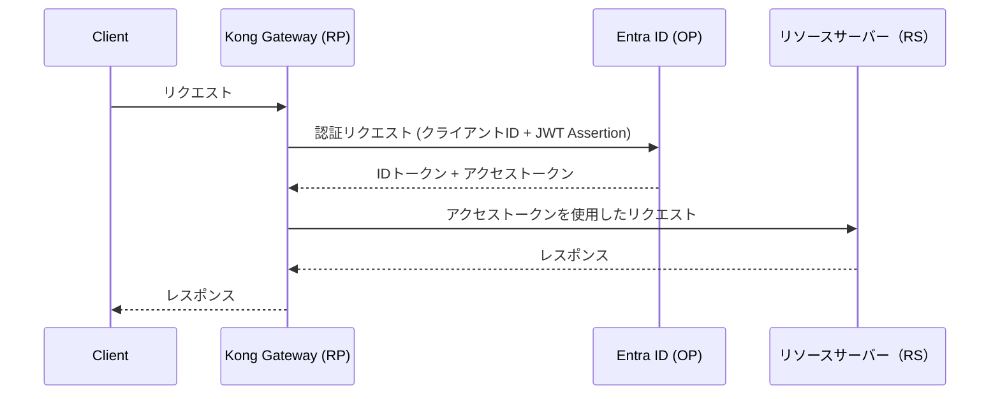

## はじめに

こんにちは 🖐️ 今日は、Kong Gateway の OpenID Connect(OIDC) プラグインを使用していて、検証に時間がかかった内容の共有です。OIDC プラグインは、設定を見てもらえると分かる通り、とんでもない数のパラメータが存在します。

https://developer.konghq.com/plugins/openid-connect/reference/

また、いくつかの例も提供されているのですが、実現したい例が見つからない場合、頑張って設定項目を調査する必要があります。同じケースを実現したい人がいるかもしれない（+ 自分の備忘録）と思い、記事にまとめました。

## 実現したいことの整理

Kong の OIDC プラグインは、OIDC プロトコルを使用して、認証と認可を行うためのプラグインです。よくある OIDC のフローでは、Kong Gateway(RP)と任意の OP(例では、Entra ID を利用)間でクライアント ID とシークレットを使用した認証が行われ、ID・アクセストークンを取得します。細かいフローは割愛しますが、以下のようなシーケンスとなります。



Entra ID では、クライアントシークレットを利用しない認証方法として、[証明書を使用して署名された JWT を使った資格証明（JWT Assertion）](https://learn.microsoft.com/ja-jp/entra/identity-platform/certificate-credentials)を行うことができます。クライアントシークレットという共有の秘密に依存する認証方式に比べ、署名の検証に使用する公開鍵だけ OP 側へ連携しておけば良いため、セキュリティ強度の向上が期待できます。また、JWT Assertion には、`exp`（有効期限）や `nbf`（有効開始時間）、`jti`（JWT ID）などのクレームを含めることができ、トークンの使用期間、リプレイ防止などを制御することができます。フローはクライアントシークレットを使用するパターンほとんど同じですが、事前に鍵ペアを作成しておく点やクライアントシークレットの代わりに JWT Assertion を使用する点が異なります。



## 設定手順

今回の設定手順は、以下の前提で進めます。

- Kong Gateway(EE)がすでにセットアップされていること
- Entra ID で利用可能なアプリケーションが存在すること

それではやっていきます。

### 鍵ペアの作成

まずは、JWT Assertion の署名とその検証に使用する鍵ペアを作成します。内容は、自身の環境などに合わせて適宜修正してください。

```sh
openssl req -x509 -newkey rsa:2048 \
  -keyout cert/server.key \
  -out cert/server.crt \
  -days 365 \
  -nodes \
  -subj "/C=JP/ST=Tokyo/L=Tokyo/O=Example/OU=Dev/CN=local.example.com" \
  -addext "subjectAltName=DNS:local.example.com,DNS:localhost,IP:127.0.0.1"
```

鍵ペアの作成が完了したら公開鍵（`server.crt`）を Entra ID へ登録します。


_作成した公開鍵を Entra ID へアップロードする_

### JWK の準備

先ほどの手順で作成した秘密鍵を Kong Gateway の OIDC プラグインで使用するために、JWK(JSON Web Key)形式へ変換します。まずは、JWT Assertion に含める thumbprint を計算します。

```sh
X5T=$(
  openssl x509 -in cert/server.crt -outform der \
  | openssl dgst -sha1 -binary \
  | openssl base64 -A \
  | tr '+/' '-_' | tr -d '='
)
```

続いて、JWK への変換には、[step](https://prof.infra.smallstep.com/) というツールを使用しますが、類似のことができるのであれば、何を使っても大丈夫です。

```sh
step crypto jwk create \
  --from-pem cert/server.key \
  --use sig \
  --kid $X5T \
  --alg PS256 \
  --kty RSA \
  jwk-public.json jwk-private.json
```

変換が完了すると、`jwk-public.json`, `jwk-private.json` が作成されます。作成された `jwk-private.json` は暗号化されているため、再度 `step` を使用して復号します。

```sh
cat jwk-private.json | step crypto jwe decrypt | jq . > jwk-private-plain.json
```

作成された `jwk-private-plain.json` を参照すると以下のようになっています。

```json
{
  "use": "sig",
  "kty": "RSA",
  "kid": "I7vZWNROsDD32b8TY0hY-eblzb8",
  "alg": "PS256",
  "n": "nxSRqfoXy37tcnE1yAcs6QgckEdPINAIA3M7WQzny9j7x-4w-685pf5nh1oDvwvTgjBBkdsDh-Lx-7Ov5etBch9txjAq9Tpg5zWSBd-kAryK8ow0yW2bj1KyBAT8Ff6-YLJoZ3-s84eaO5kfi6U2-nofWtLp8M5wthoBqtqlwtbGuPnZC5VMu4yZIIUQMdbdt77CE1pmlrUFhttIXhYJxAW5iZofPVvzIw-zhMnDjvPtQtT-hxun2FUBLa0xUzfFzWWHtyIZoXuLEoHDQzoIBEYiPdvUB8BOJs4aV3fdAtYLa1c3t5gNFEu1MzwXTx7bWKxjO3MRywqcPP9iRTuxYw",
  "e": "AQAB",
  "d": "QqPdOXV5DlhHpA9k1jybRauOO6qDrV04XimhjPZpC-4D24ceofCPl8fxGrRMqXWMzxbkAPPckMozUJu_bfOVYPdlhwaamEwyV-kLGMbM8BCHrH-rhU4TQoED7ccgyx4CJoPWVLUZgJMnuxu0KU22sEsEY4nDUotIkCBo3mfl1K53RccKwzOChEI58a3u_OLyCwWDLPW0Qzaqe0YMcmWk8FQKhDUAxoXRut-dLQSPCKv3H7DIZgSL6ICGLmMeKKXfU19NXm435HoWile5uDb5RNYDtZHvairp9MUqzIVIIYGvtKOC5gaomYKUhZazjK4sJgNbM1sCki9eso_-S1hhUQ",
  "p": "zoTBS7wUmvnHgIzjVtk8QKNWO03_EopdC-uBc37ySUbGDN9Mw045n5Z5SLpbYJrKQUPPggsDrgd5cdQ1aweDiogL-rY0xoUzvtzsFtXXsih0nRBz_7CRIij8g8paYfEuIZDtyVd6xXkItJzfNcDBxejy49rLaYCT600AFtAoJ-c",
  "q": "xTIXiZ2fVoH2pT_z_7PbIbuo-hNb4FuJ9UylRVeFQc3l7QDW-3vk39LFc07AQb8TzEzT1z5pTnSh6Ip8JvBgs4Kuh3LXXw7otrPba_Az-lRM0yd_Pm-X3khP_2Hd0wfd35yT6zM19zUbq6NLSLrwLqrUP4P0yrmiFH0OAEmxCyU",
  "dp": "Ig4ELe_y2edsfYc-CdlCtUn580eWU0FbvJZ2P0xkua6hBAhiiSZCHE3c7CBG5zQ_O-npswEL90umPB4JPP_9Mf_jMdGP_FiEwul9SPq0Wd2P9UJ8TmKYXDC0Cyt4IgR6XfCfNX9mcF_YDqh7qkqB6ZfTTb2Lo3cfbULCTADBTms",
  "dq": "eLujl5kO3ksx9JkETfETYELiQUIrBWFmRO6JXbwpFVH3zTSva0e-qJ8GTwPPSDGx8Gq1ZNqMZQGZw6NOQhT4T8_aBYn1fPjG2F2kISDu4fxNERbknBh81hZWDFkiFDuDx425Ls6q4tD8QQj4Ze42cYwb6UtkS9598qdiNCDqKZU",
  "qi": "oyO0WdqgV3RkzTSL2-ScZ7TkCJxLdm3KDVTGwCDMDd85TWtDx6m7gv3P0Sz9-wjMPQP-bWM3LmOv5a_6YBp7SJNWl7W1t_IYAsgRc5fGydQ64t96bElHy6l7xeFyY9y00xUopqzLPyTE0h93dbx7Z89COYK3NmN9EdvV54YZO_8"
}
```

### OIDC プラグインの設定

続いて、作成された JWK を使用して、OIDC プラグインの設定を行います。設定は、decK 形式で行なっていますが使用されるツールに応じて適宜読み替えてください。

```yaml
plugins:
  - name: openid-connect
    config:
      issuer: ${{ env "DECK_ENTRA_ID_ISSUER" }} # Issuerと書きつつもOIDC Discovery Endpointを指定してください。
      issuers_allowed:
        - https://sts.windows.net/${{ env "DECK_ENTRA_ID_TENANT_ID" }}/
        - https://login.microsoftonline.com/${{ env "DECK_ENTRA_ID_TENANT_ID" }}/v2.0
      client_id:
        - ${{ env "DECK_ENTRA_ID_CLIENT_ID" }}
      redirect_uri:
        - https://local.example.com/callback
      scopes:
        - ${{ env "DECK_ENTRA_ID_CLIENT_ID" }}/.default
      client_auth:
        - private_key_jwt # private_key_jwt を選択することがポイント
      client_alg:
        - PS256
      # 生成された jwk-private-plain.json を参照しながら設定する
      client_jwk:
        - use: sig
          kty: RSA
          kid: rZXxb7nvJDyPCeorV5Cs8T31WMc
          alg: PS256
          "n": "nxSRqfoXy37tcnE1yAcs6QgckEdPINAIA3M7WQzny9j7x-4w-685pf5nh1oDvwvTgjBBkdsDh-Lx-7Ov5etBch9txjAq9Tpg5zWSBd-kAryK8ow0yW2bj1KyBAT8Ff6-YLJoZ3-s84eaO5kfi6U2-nofWtLp8M5wthoBqtqlwtbGuPnZC5VMu4yZIIUQMdbdt77CE1pmlrUFhttIXhYJxAW5iZofPVvzIw-zhMnDjvPtQtT-hxun2FUBLa0xUzfFzWWHtyIZoXuLEoHDQzoIBEYiPdvUB8BOJs4aV3fdAtYLa1c3t5gNFEu1MzwXTx7bWKxjO3MRywqcPP9iRTuxYw"
          "e": "AQAB"
          "d": "QqPdOXV5DlhHpA9k1jybRauOO6qDrV04XimhjPZpC-4D24ceofCPl8fxGrRMqXWMzxbkAPPckMozUJu_bfOVYPdlhwaamEwyV-kLGMbM8BCHrH-rhU4TQoED7ccgyx4CJoPWVLUZgJMnuxu0KU22sEsEY4nDUotIkCBo3mfl1K53RccKwzOChEI58a3u_OLyCwWDLPW0Qzaqe0YMcmWk8FQKhDUAxoXRut-dLQSPCKv3H7DIZgSL6ICGLmMeKKXfU19NXm435HoWile5uDb5RNYDtZHvairp9MUqzIVIIYGvtKOC5gaomYKUhZazjK4sJgNbM1sCki9eso_-S1hhUQ"
          "p": "zoTBS7wUmvnHgIzjVtk8QKNWO03_EopdC-uBc37ySUbGDN9Mw045n5Z5SLpbYJrKQUPPggsDrgd5cdQ1aweDiogL-rY0xoUzvtzsFtXXsih0nRBz_7CRIij8g8paYfEuIZDtyVd6xXkItJzfNcDBxejy49rLaYCT600AFtAoJ-c"
          "q": "xTIXiZ2fVoH2pT_z_7PbIbuo-hNb4FuJ9UylRVeFQc3l7QDW-3vk39LFc07AQb8TzEzT1z5pTnSh6Ip8JvBgs4Kuh3LXXw7otrPba_Az-lRM0yd_Pm-X3khP_2Hd0wfd35yT6zM19zUbq6NLSLrwLqrUP4P0yrmiFH0OAEmxCyU"
          "dp": "Ig4ELe_y2edsfYc-CdlCtUn580eWU0FbvJZ2P0xkua6hBAhiiSZCHE3c7CBG5zQ_O-npswEL90umPB4JPP_9Mf_jMdGP_FiEwul9SPq0Wd2P9UJ8TmKYXDC0Cyt4IgR6XfCfNX9mcF_YDqh7qkqB6ZfTTb2Lo3cfbULCTADBTms"
          "dq": "eLujl5kO3ksx9JkETfETYELiQUIrBWFmRO6JXbwpFVH3zTSva0e-qJ8GTwPPSDGx8Gq1ZNqMZQGZw6NOQhT4T8_aBYn1fPjG2F2kISDu4fxNERbknBh81hZWDFkiFDuDx425Ls6q4tD8QQj4Ze42cYwb6UtkS9598qdiNCDqKZU"
          "qi": "oyO0WdqgV3RkzTSL2-ScZ7TkCJxLdm3KDVTGwCDMDd85TWtDx6m7gv3P0Sz9-wjMPQP-bWM3LmOv5a_6YBp7SJNWl7W1t_IYAsgRc5fGydQ64t96bElHy6l7xeFyY9y00xUopqzLPyTE0h93dbx7Z89COYK3NmN9EdvV54YZO_8"
          x5t: I7vZWNROsDD32b8TY0hY-eblzb8
      auth_methods:
        - authorization_code
        - session
      response_mode: form_post
      preserve_query_args: true
      login_action: redirect
      login_tokens:
      session_storage: redis
      redis:
        host: redis
        port: 6379
```

:::message

`config.client_jwt` の `d`, `p`, `q`, `dp`, `dq`, `qi` などは、いわゆる秘密鍵の本体になります。今は、この記事のための鍵ペアを作っており、わかりやすさのために設定ファイルに直接記述していますが、本来であれば Vault などのシークレットストアへ格納し、それを参照する方法を取ることを推奨します。

https://developer.konghq.com/gateway/entities/vault/

:::

クライアント ID、シークレットを用いた場合との差分について解説します。

まずは、`config.client_auth` というパラメータについてです。

```yaml
client_auth:
  - private_key_jwt
```

こちらのパラメータは、RP と OP 間で各種トークンを取得する際の認証方法を指定します。通常の認可コードフローでは、`client_secret_basic` というクライアント ID、シークレットを利用する方法がデフォルト値として選択されるのですが、明示的に `private_key_jwt` へ変更することで、JWT Assertion を使った認証がサポートされます。

次に、`config.client_alg`, `config.client_jwk` についてです。

```yaml
client_alg:
  - PS256
client_jwk:
  - use: sig
    kty: RSA
    kid: rZXxb7nvJDyPCeorV5Cs8T31WMc
    alg: PS256
    "n": "nxSRqfoXy37tcnE1yAcs6QgckEdPINAIA3M7WQzny9j7x-4w-685pf5nh1oDvwvTgjBBkdsDh-Lx-7Ov5etBch9txjAq9Tpg5zWSBd-kAryK8ow0yW2bj1KyBAT8Ff6-YLJoZ3-s84eaO5kfi6U2-nofWtLp8M5wthoBqtqlwtbGuPnZC5VMu4yZIIUQMdbdt77CE1pmlrUFhttIXhYJxAW5iZofPVvzIw-zhMnDjvPtQtT-hxun2FUBLa0xUzfFzWWHtyIZoXuLEoHDQzoIBEYiPdvUB8BOJs4aV3fdAtYLa1c3t5gNFEu1MzwXTx7bWKxjO3MRywqcPP9iRTuxYw"
    "e": "AQAB"
    "d": "QqPdOXV5DlhHpA9k1jybRauOO6qDrV04XimhjPZpC-4D24ceofCPl8fxGrRMqXWMzxbkAPPckMozUJu_bfOVYPdlhwaamEwyV-kLGMbM8BCHrH-rhU4TQoED7ccgyx4CJoPWVLUZgJMnuxu0KU22sEsEY4nDUotIkCBo3mfl1K53RccKwzOChEI58a3u_OLyCwWDLPW0Qzaqe0YMcmWk8FQKhDUAxoXRut-dLQSPCKv3H7DIZgSL6ICGLmMeKKXfU19NXm435HoWile5uDb5RNYDtZHvairp9MUqzIVIIYGvtKOC5gaomYKUhZazjK4sJgNbM1sCki9eso_-S1hhUQ"
    "p": "zoTBS7wUmvnHgIzjVtk8QKNWO03_EopdC-uBc37ySUbGDN9Mw045n5Z5SLpbYJrKQUPPggsDrgd5cdQ1aweDiogL-rY0xoUzvtzsFtXXsih0nRBz_7CRIij8g8paYfEuIZDtyVd6xXkItJzfNcDBxejy49rLaYCT600AFtAoJ-c"
    "q": "xTIXiZ2fVoH2pT_z_7PbIbuo-hNb4FuJ9UylRVeFQc3l7QDW-3vk39LFc07AQb8TzEzT1z5pTnSh6Ip8JvBgs4Kuh3LXXw7otrPba_Az-lRM0yd_Pm-X3khP_2Hd0wfd35yT6zM19zUbq6NLSLrwLqrUP4P0yrmiFH0OAEmxCyU"
    "dp": "Ig4ELe_y2edsfYc-CdlCtUn580eWU0FbvJZ2P0xkua6hBAhiiSZCHE3c7CBG5zQ_O-npswEL90umPB4JPP_9Mf_jMdGP_FiEwul9SPq0Wd2P9UJ8TmKYXDC0Cyt4IgR6XfCfNX9mcF_YDqh7qkqB6ZfTTb2Lo3cfbULCTADBTms"
    "dq": "eLujl5kO3ksx9JkETfETYELiQUIrBWFmRO6JXbwpFVH3zTSva0e-qJ8GTwPPSDGx8Gq1ZNqMZQGZw6NOQhT4T8_aBYn1fPjG2F2kISDu4fxNERbknBh81hZWDFkiFDuDx425Ls6q4tD8QQj4Ze42cYwb6UtkS9598qdiNCDqKZU"
    "qi": "oyO0WdqgV3RkzTSL2-ScZ7TkCJxLdm3KDVTGwCDMDd85TWtDx6m7gv3P0Sz9-wjMPQP-bWM3LmOv5a_6YBp7SJNWl7W1t_IYAsgRc5fGydQ64t96bElHy6l7xeFyY9y00xUopqzLPyTE0h93dbx7Z89COYK3NmN9EdvV54YZO_8"
    x5t: I7vZWNROsDD32b8TY0hY-eblzb8
```

このあたりのパラメータは使用する IdP によって異なってくると思われますので、IdP 側の仕様をよく確認してください。Entra ID の場合、以下に記載があります。

https://learn.microsoft.com/ja-jp/entra/identity-platform/certificate-credentials

`config.client_alg` は、JWT のヘッダーに埋め込まれる `alg` を決定するためのものです。`config.client_jwk` が署名を生成するための秘密鍵と IdP 側に設定されている公開鍵のうち何を用いて検証すれば良いか？（`config.client_jwt[0].x5t`）を指定します。

:::message
Entra ID のドキュメントを参照すると、公開鍵は `x5t#S256` で指定するように読み取れますが、これを実現するためには Entra ID 側で `customKeyIdentifier` を設定する必要があります。私の環境では、マニフェストの修正ができなかったため、`x5t` を使用しています。
:::

最後に、`config.session_storage`, `config.redis` のパラメータについてです。

```yaml
session_storage: redis
redis:
  host: redis
  port: 6379
```

必須ではないと思うのですが、私の環境では Cookie に格納するセッション情報が大きすぎてデフォルトのパラメータ（`session_storage: cookie`）ではうまく動作がしませんでした。デバッグログを確認すると、以下のようになっており、認可コードフローは成功しているにもかかわらずセッションを見つけることができずにループしていることが確認できます。

```sh
gateway  | 2026/01/14 10:52:42 [debug] 2721#0: *10378 [lua] handler.lua:1368: [openid-connect] trying to exchange credentials using token endpoint with caching enabled
gateway  | 2026/01/14 10:52:42 [notice] 2721#0: *10378 [lua] cache.lua:1328: tokens_load(): [openid-connect] loading tokens from the identity provider, client: 192.168.65.1, server: kong, request: "POST /callback HTTP/1.0", host: "local.example.com", referrer: "https://login.microsoftonline.com/", request_id: "8a85f01328e8056f006a3b43818fff48"
gateway  | 2026/01/14 10:52:42 [debug] 2721#0: *10378 [lua] http_connect.lua:253: execute_original_func(): poolname: https:login.microsoftonline.com:443:true:login.microsoftonline.com:false:::
gateway  | 2026/01/14 10:52:42 [debug] 2721#0: *10378 [lua] handler.lua:1395: [openid-connect] exchanged credentials with tokens
gateway  | 2026/01/14 10:52:42 [debug] 2721#0: *10378 [lua] handler.lua:1414: [openid-connect] verifying tokens
gateway  | 2026/01/14 10:52:42 [debug] 2721#0: *10378 [lua] handler.lua:1421: [openid-connect] tokens verified
gateway  | 2026/01/14 10:52:42 [debug] 2721#0: *10378 [lua] handler.lua:1452: [openid-connect] checking for access token
gateway  | 2026/01/14 10:52:42 [debug] 2721#0: *10378 [lua] handler.lua:1457: [openid-connect] found access token
gateway  | 2026/01/14 10:52:42 [debug] 2721#0: *10378 [lua] handler.lua:1591: [openid-connect] checking for access token expiration
gateway  | 2026/01/14 10:52:42 [debug] 2721#0: *10378 [lua] handler.lua:1594: [openid-connect] access token is valid and has not expired
gateway  | 2026/01/14 10:52:42 [debug] 2721#0: *10378 [lua] handler.lua:1837: check_required(): [openid-connect] verifying required issuers
gateway  | 2026/01/14 10:52:42 [debug] 2721#0: *10378 [lua] handler.lua:1876: check_required(): [openid-connect] issuers found in access token
gateway  | 2026/01/14 10:52:42 [debug] 2721#0: *10378 [lua] handler.lua:1898: check_required(): [openid-connect] required issuers were found
gateway  | 2026/01/14 10:52:42 [debug] 2721#0: *10378 [lua] consumers.lua:144: [openid-connect] removing possible remnants of anonymous
gateway  | 2026/01/14 10:52:42 [debug] 2721#0: *10378 [lua] handler.lua:2052: [openid-connect] finding credential claim value
gateway  | 2026/01/14 10:52:42 [debug] 2721#0: *10378 [lua] handler.lua:2086: [openid-connect] credential claim found in access token
gateway  | 2026/01/14 10:52:42 [debug] 2721#0: *10378 [lua] handler.lua:2126: [openid-connect] credential found 'gswVwfui5qJ24FiJQSl8jpgJ4Ofi7YgA4iIi6i3wJDw'
gateway  | 2026/01/14 10:52:42 [debug] 2721#0: *10378 [lua] handler.lua:2362: [openid-connect] setting upstream and downstream headers
gateway  | 2026/01/14 10:52:42 [debug] 2721#0: *10378 [lua] handler.lua:2790: [openid-connect] login with redirect login action
gateway  | 2026/01/14 10:52:42 [debug] 2721#0: *10378 [lua] instrumentation.lua:395: runloop_log_after(): [tracing] collected 5 spans:
gateway  | Span #1 name=kong duration=514.136832ms attributes={"http.flavor":"1.0","http.scheme":"http","http.client_ip":"192.168.65.1","http.host":"local.example.com","kong.request.id":"8a85f01328e8056f006a3b43818fff48","net.peer.ip":"172.26.0.2","http.method":"POST","http.route":"/callback","http.status_code":302,"http.url":"http://local.example.com/callback"}
gateway  | Span #2 name=kong.router duration=0.281600ms
gateway  | Span #3 name=kong.access.plugin.openid-connect duration=512.931584ms
gateway  | Span #4 name=kong.internal.request duration=508.677632ms attributes={"http.user_agent":"lua-resty-http/0.17.2 (Lua) ngx_lua/10028","http.flavor":1.1,"http.url":"https://login.microsoftonline.com/f177c1d6-50cf-49e0-818a-a0585cbafd8d/oauth2/v2.0/token","http.status_code":200,"http.method":"POST"}
gateway  | Span #5 name=kong.dns duration=1.106176ms attributes={"dns.record.ip":"20.190.166.68","dns.record.domain":"login.microsoftonline.com","dns.record.port":443}
gateway  | 192.168.65.1 - - [14/Jan/2026:10:52:42 +0000] "POST /callback HTTP/1.0" 302 0 "https://login.microsoftonline.com/" "Mozilla/5.0 (Macintosh; Intel Mac OS X 10_15_7) AppleWebKit/537.36 (KHTML, like Gecko) Chrome/143.0.0.0 Safari/537.36" kong_request_id: "8a85f01328e8056f006a3b43818fff48"
gateway  | 2026/01/14 10:52:42 [debug] 2722#0: *10379 [lua] init.lua:302: calling patched method 'openid-connect:access'
gateway  | 2026/01/14 10:52:42 [debug] 2722#0: *10379 [lua] handler.lua:208: [openid-connect] loading discovery information
gateway  | 2026/01/14 10:52:42 [debug] 2722#0: *10379 [lua] handler.lua:285: [openid-connect] initializing library
gateway  | 2026/01/14 10:52:42 [debug] 2722#0: *10379 [lua] handler.lua:894: [openid-connect] trying to open authorization code flow session
gateway  | 2026/01/14 10:52:42 [debug] 2722#0: *10379 [lua] sessions.lua:167: session_open(): [openid-connect] trying to open session using cookie named 'authorization'
gateway  | 2026/01/14 10:52:42 [debug] 2722#0: *10379 [lua] handler.lua:1043: [openid-connect] authorization code flow session was not found (missing session cookie)
gateway  | 2026/01/14 10:52:42 [debug] 2722#0: *10379 [lua] handler.lua:1050: [openid-connect] creating authorization code flow request
gateway  | 2026/01/14 10:52:42 [debug] 2722#0: *10379 [lua] handler.lua:1085: [openid-connect] redirecting client to openid connect provider
gateway  | 192.168.65.1 - - [14/Jan/2026:10:52:42 +0000] "GET /mock/uuid HTTP/1.0" 302 0 "https://login.microsoftonline.com/" "Mozilla/5.0 (Macintosh; Intel Mac OS X 10_15_7) AppleWebKit/537.36 (KHTML, like Gecko) Chrome/143.0.0.0 Safari/537.36" kong_request_id: "fa7fa65096967a22cbef232ed1aabd4f"
gateway  | 2026/01/14 10:52:42 [debug] 2722#0: *10379 [lua] instrumentation.lua:395: runloop_log_after(): [tracing] collected 3 spans:
gateway  | Span #1 name=kong duration=2.167040ms attributes={"http.flavor":"1.0","http.scheme":"http","http.client_ip":"192.168.65.1","http.host":"local.example.com","kong.request.id":"fa7fa65096967a22cbef232ed1aabd4f","net.peer.ip":"172.26.0.2","http.method":"GET","http.route":"/mock","http.status_code":302,"http.url":"http://local.example.com/mock/uuid"}
gateway  | Span #2 name=kong.router duration=0.154368ms
gateway  | Span #3 name=kong.access.plugin.openid-connect duration=0.832768ms
```

[Kong の OIDC プラグインのドキュメント](https://developer.konghq.com/plugins/openid-connect/#debugging-the-oidc-plugin)を参照すると、以下のような記述があります。

> Session-related issues are often caused by large cookies. Try storing the session data in Redis or memcache, as that will make the session cookie much smaller. Set this up using config.session_storage.

ということで、おとなしく Redis をセッションストレージとして活用したら問題なく動作しました。

## おわり

今回は、クライアントシークレットを使わずに Kong Gateway, Entra ID 間で認可コードフローを行う方法を解説しました。ドキュメントに実例がなく検証が少し大変でしたが、これで少し仲良くなれたような気がします。
