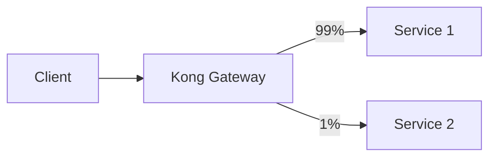
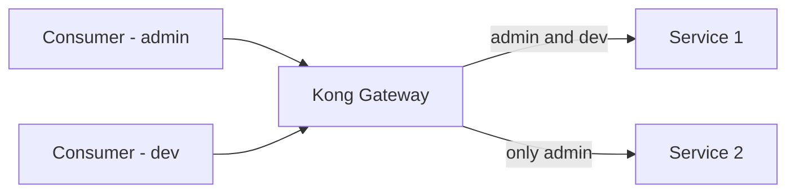
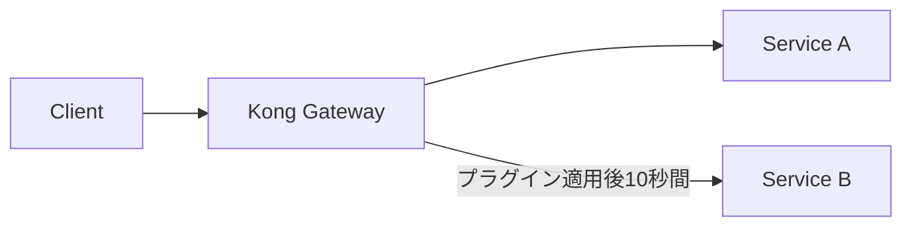

## はじめに

Kong Gateway には、数多くのプラグインが存在し要件に応じてさまざまな設定を追加することができます。ここでは、Canary Release のプラグインを試してみます。

## Canary Release

https://docs.konghq.com/hub/kong-inc/canary/

いわゆるカナリアリリースをするためのプラグインで、3 パターンのルーティングが可能です。

1. 固定のパーセンテージ
2. ACL グループを用いた制御（[ACL プラグイン](https://docs.konghq.com/hub/kong-inc/acl/) と併用）
3. Service A -> Service B に時間と期間を設けてトラフィック制御

順番に試していきます。

### 対象のサービス

Gin で実装したシンプルなサービスを対象にこのプラグインを試してみます。このサービスは以下のようなエンドポイントを持ちます。

- `/ping`: pong という文字列を返す
- `/error`: Internal Server Error が発生し、HTTP Status 500 を返す

以下の検証では、カナリアリリースする側を `/error` として検証を進めていきます。また、サービス自体は以下のように定義しておきます。decK で設定を流し込むなり、DB-less で構築するなり好きに作ってください。

```yaml
_format_version: "3.0"
_transform: true

services:
  - name: gin-service
    host: api
    port: 8080
    protocol: http
    routes:
      - name: gin-route
        paths:
          - /v1
        strip_path: true
```

### 固定パーセンテージ

固定のパーセンテージでトラフィック制御するために使います。1%のトラフィックだけ Service B に流す場合の例は以下の図の通りです。



#### hash: none

全てのトラフィックに対して、ランダムにルーティングされます。例えば、以下のように `/error` に対して 10%ルーティングするように設定してみます。

```yaml
plugins:
  - name: canary
    service: gin-service
    config:
      hash: none
      percentage: 10
      upstream_host: api
      upstream_port: 8080
      upstream_uri: /error
```

おおよそ、10% のトラフィックで 500 エラーが返却されていることが確認できます。


高度な制御を必要としないカナリアリリースには、これで十分そうに見えます。これ以外にも `consumer`, `ip`, `header` ベースでトラフィック制御ができそうなので用途に応じて使い分けると良いと思います。

### ACL グループを用いた制御

Kong では、API を実行するクライアントをコンシューマーと呼びます。ルーティングのイメージは以下の通りです。



ここでは、以下のような設定を書いてその振る舞いを見てみましょう。

```yaml
consumers:
  - username: admin
    keyauth_credentials:
      - key: admin
    acls:
      - group: admin
  - username: dev
    keyauth_credentials:
      - key: dev
    acls:
      - group: dev

plugins:
  - name: key-auth
    service: gin-service
    config:
      key_names:
        - apikey
  - name: acl
    service: gin-service
    config:
      allow:
        - admin
        - dev
  - name: canary
    service: gin-service
    config:
      hash: allow
      groups:
        - admin
      upstream_host: api
      upstream_port: 8080
      upstream_uri: /error
```

ポイントは、`gin-service` 全体を ACL(Access Control List) + Key Auth で保護しつつ、新バージョンは `admin` のみを許可する設定にしていることです。実際に実行してみると以下の通りです。

まずは、API Key をリクエストに付与しない場合は、Key Auth プラグインによって未認証となり、401 が返却されることが確認できます。

```sh
http :8000/v1/ping

HTTP/1.1 401 Unauthorized
Connection: keep-alive
Content-Length: 96
Content-Type: application/json; charset=utf-8
Date: Fri, 20 Jun 2025 14:19:21 GMT
Server: kong/3.10.0.1-enterprise-edition
WWW-Authenticate: Key
X-Kong-Request-Id: 56afa730d2686459e8b002732746d169
X-Kong-Response-Latency: 2

{
    "message": "No API key found in request",
    "request_id": "56afa730d2686459e8b002732746d169"
}
```

`admin` グループに属しているコンシューマーからアクセスしてみると、きちんと新バージョン（内部で必ず Internal Server Error が発生する）にルーティングされていることが確認できます。

```sh
http :8000/v1/ping apikey:admin

HTTP/1.1 500 Internal Server Error
Connection: keep-alive
Content-Length: 0
Date: Fri, 20 Jun 2025 14:20:22 GMT
Server: kong/3.10.0.1-enterprise-edition
Via: 1.1 kong/3.10.0.1-enterprise-edition
X-Kong-Proxy-Latency: 7
X-Kong-Request-Id: 6ead985f3952825f341d2f4822ab8633
X-Kong-Upstream-Latency: 1
```

`dev` グループに属しているコンシューマーからアクセスしてみると、旧バージョンにルーティングされていることが確認できます。

```sh
http :8000/v1/ping apikey:dev

HTTP/1.1 200 OK
Connection: keep-alive
Content-Length: 4
Content-Type: text/plain; charset=utf-8
Date: Fri, 20 Jun 2025 14:21:42 GMT
Server: kong/3.10.0.1-enterprise-edition
Via: 1.1 kong/3.10.0.1-enterprise-edition
X-Kong-Proxy-Latency: 8
X-Kong-Request-Id: 746c5077604d537117d3823957da2f1e
X-Kong-Upstream-Latency: 0

pong
```

新バージョンの本格リリース前に、社内の一部開発者などに限定的に許可したい場合は、この手法が採用できそうです。

### 時間と期間を用いた制御

プラグインを適用してからの時間とそこからの期間ベースでトラフィックの制御を行うことができます。図解すると以下の通りです。



有効にするには以下のようなプラグイン設定を行います。

```yaml
plugins:
  - name: canary
    service: gin-service
    config:
      start:
      duration: 30
      upstream_host: api
      upstream_port: 8080
      upstream_uri: /error
```

`config.start` を省略した場合は、プラグインを適用した時刻が採用され、指定秒数以内に新バージョンへのトラフィックシフトが行われます。きちんと、開始時刻まで制御したい場合は、エポック秒で指定します。動作の確認をすると以下のようになります。

```sh
for _ in {1..45}; do
  http :8000/v1/ping
  sleep 1
done

HTTP/1.1 200 OK
Connection: keep-alive
Content-Length: 4
Content-Type: text/plain; charset=utf-8
Date: Fri, 20 Jun 2025 14:47:44 GMT
Server: kong/3.10.0.1-enterprise-edition
Via: 1.1 kong/3.10.0.1-enterprise-edition
X-Kong-Proxy-Latency: 2
X-Kong-Request-Id: 3be98a5f78b1a96c0e2175087ad8742a
X-Kong-Upstream-Latency: 1

pong


HTTP/1.1 200 OK
Connection: keep-alive
Content-Length: 4
Content-Type: text/plain; charset=utf-8
Date: Fri, 20 Jun 2025 14:47:45 GMT
Server: kong/3.10.0.1-enterprise-edition
Via: 1.1 kong/3.10.0.1-enterprise-edition
X-Kong-Proxy-Latency: 1
X-Kong-Request-Id: 6b5ac064bab5cd7124d9624a8931b921
X-Kong-Upstream-Latency: 1

pong


HTTP/1.1 500 Internal Server Error
Connection: keep-alive
Content-Length: 0
Date: Fri, 20 Jun 2025 14:47:46 GMT
Server: kong/3.10.0.1-enterprise-edition
Via: 1.1 kong/3.10.0.1-enterprise-edition
X-Kong-Proxy-Latency: 2
X-Kong-Request-Id: d09d6d2fa673b454dfe6411a0a66795e
X-Kong-Upstream-Latency: 1
# ... 以下、500 レスポンスの繰り返し
```

指定秒数（30 秒）以内に新バージョンへの移行が行われ、500 レスポンスが返ってくるようになることが確認できます。
