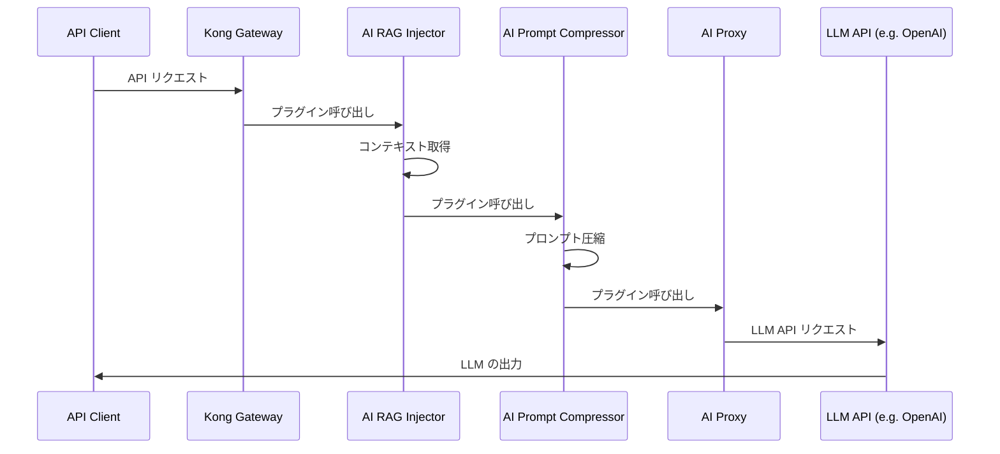

## はじめに

つい先日、Kong Gateway 3.11 がリリースされました。

https://jp.konghq.com/blog/kong-gateway-3-11-release-20250714

Datakit と呼ばれるリクエストフローを柔軟にカスタマイズする新機能や、AI 関連でいくつかアップデートがあります。本記事ではその中でも、AI Prompt Compressor と呼ばれるプラグインに焦点を当てて解説します。

:::message
本記事の内容は、Kong Gateway Enterprise Edition のみで実行可能です。npx 
:::

## AI Prompt Compressor

### プロンプトの圧縮

LLM から期待する出力を得るために、詳細なプロンプトを記述したり知識情報を補完し、プロンプトに埋め込むことは LLM 活用における有名な手法です。一方で長文のプロンプトを与えると、GPU メモリの使用量と推論コストが増加します。これを解決するための手法の一つがプロンプト圧縮です。簡単な例は、以下の通りです。

```txt
# ORIGINAL
I would like to know how many people currently live in New York City?

# COMPRESSED
What is the population of New York City?
```

見比べていただくと、どちらも日本語訳的には「ニューヨークの人口はなんですか？」になると思いますが、COMPRESSED の方はトークン（文字）数が少ないことがわかると思います。このようにプロンプトの意味を失わないようにトークン数を少なくする少なくする技術をプロンプト圧縮と呼びます。

### Kong Gateway とプロンプト圧縮

上記で説明したプロンプト圧縮ですが、Kong Gateway では AI Prompt Compressor というプラグインで実現しています。その他の AI 関連プラグインをいくつか使うと以下のようなことを実現できます。



